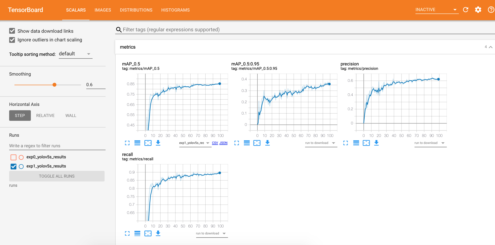
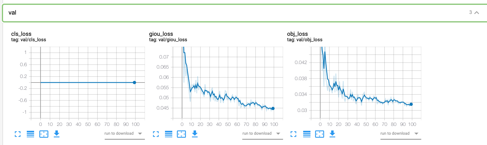
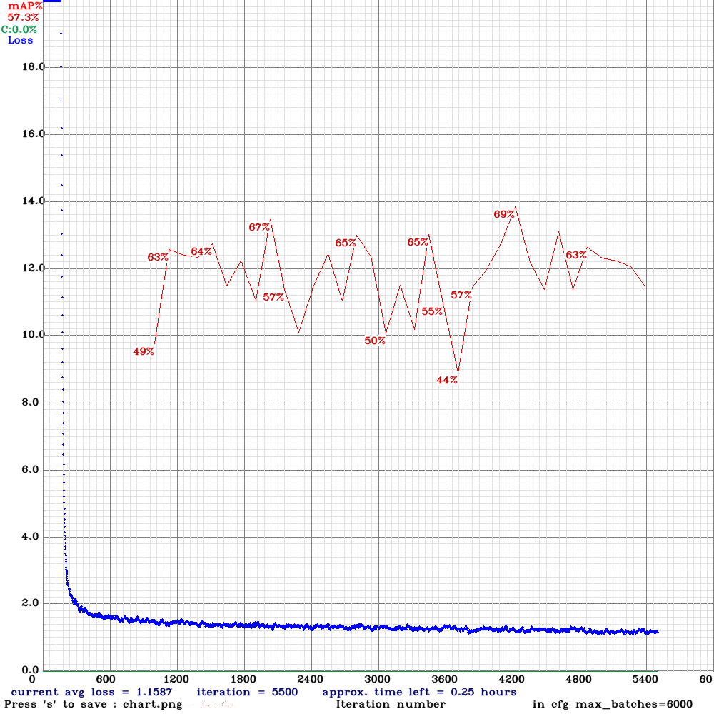

# Fruit Detection in Orchards -- (Latest Updates go first)

#### 22nd July 2020

| Parameters	| Yolov5(100 epochs) 	| 	Yolov4-tiny()	| 	Yolov4 (3800 iterations only)		| Faster RCNN
|-------|--------|---------|--------|---------|
| mAP@0.50		|  >0.85		| 0.6146	| 	0.72	| 		| 
| Precision	| 	≈  0.6	| 	0.64	| 	0.78	| 	
| Recall	| 	≈ 0.9	| 	0.68	| 	0.68	| 	
| F1-score	| 	≈ 0.72	| 	0.66	| 	0.73	| 	
| average IoU	| 			| 42.80%	| 	57.06 %	| 	

#### 15th July 2020
### Yolo-v5 with more training data.
After 100 Epochs:

#### 15th July 2020
### Yolo-v4-tiny with Data Augmentation

After 6000 iteration mAP is around 62%

  

#### 15th July 2020
### Yolo v4 with Data Augmentation
3800 iteration: Best mAP recorded :

class_id = 0, name = Mangos, ap = 71.84%   	 (TP = 604, FP = 168) 

for conf_thresh = 0.25, precision = 0.78, recall = 0.68, F1-score = 0.73 

for conf_thresh = 0.25, TP = 604, FP = 168, FN = 281, average IoU = 57.06 % 

IoU threshold = 50 %, used Area-Under-Curve for each unique Recall 

mean average precision (mAP@0.50) = 0.718374, or 71.84 % 

#### 13th July 2020 
|Title	 |    Architectures Used |	Data Augmentation Techniques |	Evaluation of Detection Performance |	Graphs Plotted | Results   
|-------|--------|---------|--------|---------| ---------|
| Deep Fruit Detection in Orchards | Faster R-CNN |Tiling approach FR-CNN |	Image Flipping and Rescaling| 	Average Precision Response Area under Precision Recall Curve, F1-score	Avg.Precision vs  Number of Training images|	F1 score > 0.9; Precision = 0.958; Recall = 0.863|
| Fast implementation of real-time fruit detection in apple orchards usingdeep learning | LedNet	|Two level scale amplification |	Average Precision Response, IoU, Precision, Recall|	Focal Loss and MSE functions vs Object confidence Score|	Recall = 0.821; Accuracy = 0.853|

####  Yolo-v5 model with Data Augmentation ---  Update : 12th July 2020  

Here are some insights I gathered after testing:

Both of them showed the same detection results with the test dataset although yolov5 was faster. But in very a few images yolov4 captured the occluded mangos very well.

When tested on data outside the test dataset, yolov4 has good detection results relatively.

Yolo v4 tiny detections to the left and that of Yolov5 to the right. 

   

  

####  Yolo-v4-tiny without Data Augmentation ---  Update : 30th June 2020   

 

#### Yolo-v4  without Data Augmentation ---  Update : 28th June 2020   

 

